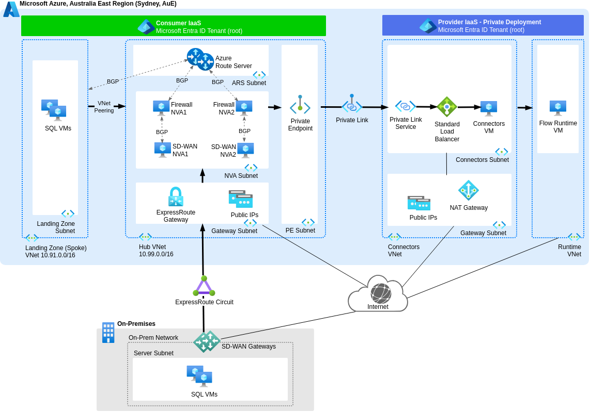

# Use Private Endpoint in Hub VNet for Private Deployment

## Context and Problem Statement

We aim to provide secure access between our provider-managed Estuary Flow Private Deployment (compute) data plane in Azure Australia East and our various targets and sources, both within the same Azure region and on-premises.
Which private connectivity option should we select?

## Decision Drivers

Align with the [Estuary Flow Private Deployment option](https://docs.estuary.dev/getting-started/deployment-options/#private-deployment) using Azure Private Link, and the design principles of the [Azure Well-Architected Framework (WAF)](https://learn.microsoft.com/en-us/azure/well-architected/pillars) pillars at the workload level:

* Operational Excellence
* Security
* Reliability
* Performance Efficiency
* Cost Optimization

## Considered Options

* Private Endpoint in Hub Virtual Network (VNet)
* Private Endpoints in Landing Zone Target and Source (Spoke) VNets
* Other option, if required (to be confirmed)

## Decision Outcome

Chosen option: "Private Endpoint in Hub VNet", because it aligns with the WAF pillars decision criteria and the [Azure Private Link in a hub-and-spoke network](https://learn.microsoft.com/en-us/azure/architecture/networking/guide/private-link-hub-spoke-network) reference architecture.

### Consequences

* Good operationally, because it enables options for streamlined, standard, and safe deployment practices through automation, such as the recently updated [Azure Verified Modules for Platform Landing Zones (ALZ)](https://azure.github.io/Azure-Landing-Zones/terraform/). E.g., a [Private Endpoint module](https://azure.github.io/Azure-Verified-Modules/indexes/terraform/tf-resource-modules/) exists in the [AVM catalog](https://azure.github.io/Azure-Verified-Modules/indexes/terraform/tf-resource-modules/).
* Good security, because policies can be managed centrally when traffic flows through the firewall Network Virtual Appliances (NVA) in the Azure Hub VNet. Refer to traffic flow arrows in [the conceptual design diagram further below](#conceptual-design-diagram-for-private-endpoint-in-hub-vnet).
* Good reliability and cost optimisation, because a single deployed Private Endpoint that all peered Spoke VNets can access scales well.

## More Information

[ADR-0001](0001-use-estuary-flow-private-deployment) reasons about selecting the Estuary Flow Private Deployment.

### Reference Design for Private Link Service

See [Azure Private Link Service Overview](https://learn.microsoft.com/en-us/azure/private-link/private-link-service-overview) for Microsoft's reference architecture, and the diagram copied below:

### Conceptual Design Diagram for Private Endpoint in Hub VNet

The following diagram shows the proposed deployment of a Private Endpoint in a Hub VNet that satisfies this decision record. Refer to the arrows for data plane traffic flowing from sources to Estuary Flow Private Deployment Connectors.

[Edit a copy of the above diagram (from the main branch) in Draw.io](https://app.diagrams.net/#Uhttps://raw.githubusercontent.com/NetAion/avm-compositions/main/docs/diagrams/source/private-link.drawio)
