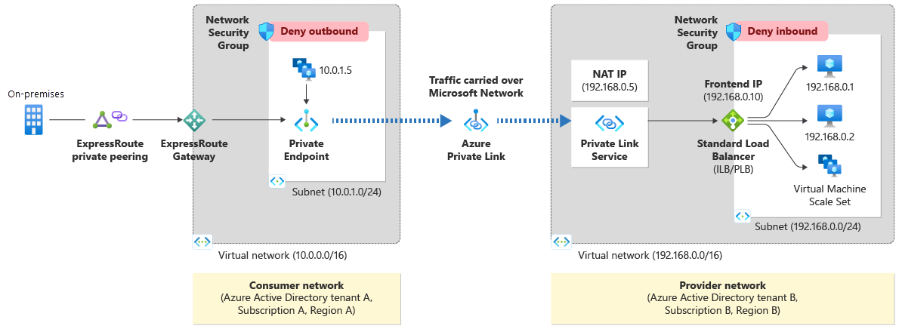
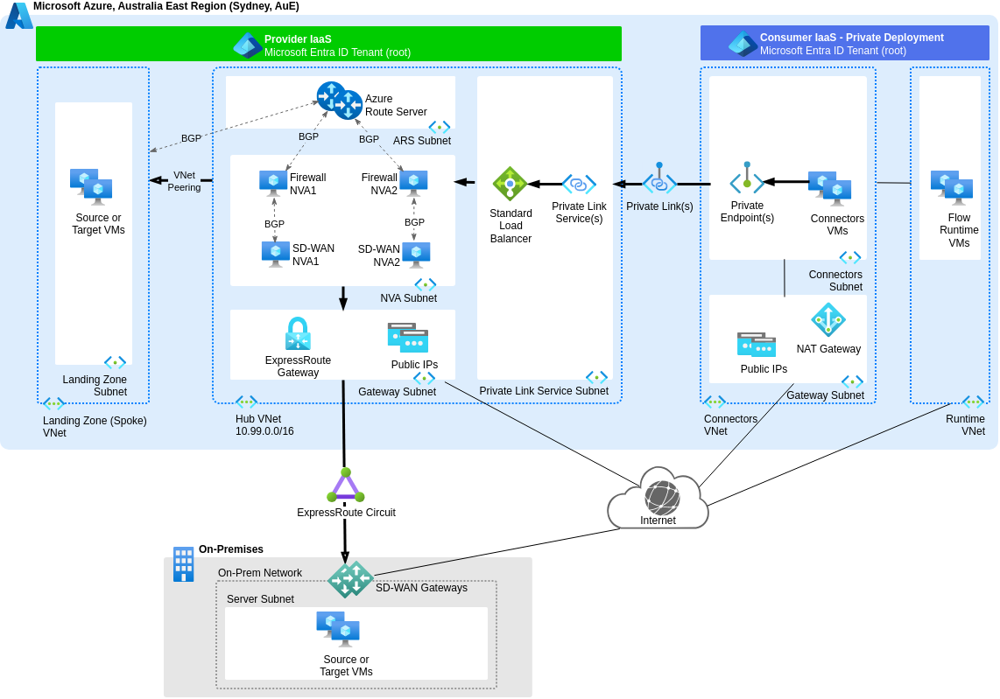
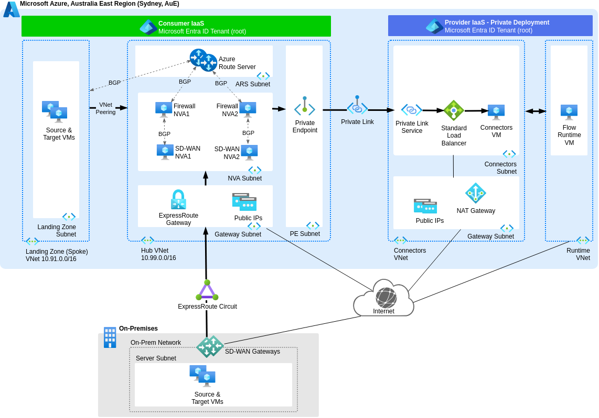

# Use Private Link Service in Hub VNet for Private Deployment

## Context and Problem Statement

We aim to provide secure access between our provider-managed Estuary Flow Private Deployment (compute) data plane in Azure Australia East and our various targets and sources, both within the same Azure region and on-premises.
Which private connectivity option should we select?

## Decision Drivers

Align with the [Estuary Flow Private Deployment option](https://docs.estuary.dev/getting-started/deployment-options/#private-deployment) using Azure Private Link, and the design principles of the [Azure Well-Architected Framework (WAF)](https://learn.microsoft.com/en-us/azure/well-architected/pillars) pillars at the workload level:

* Operational Excellence
* Cost Optimization
* Security
* Reliability
* Performance Efficiency

## Considered Options

* Single Private Link Service in Hub Virtual Network (VNet)
* Single Private Endpoint in Hub VNet
* Multiple Private Link Services in (Target & Source Landing Zone) Spoke VNets
* Multiple Private Endpoints in (Target & Source Landing Zone) Spoke VNets

## Decision Outcome

Chosen option: "Single Private Link Service in Hub VNet", because it provides centralised and scalable traffic management, and it aligns with Estuary's recommendation to act as service provider to their private deployment as service consumer.

## Pros and Cons of the Options

### Single Private Link Service in Hub VNet

* Good reliability, because Estuary recommends to act as service provider to their private deployment as service consumer.
* Good security and visibility, because policies can be managed centrally when traffic flows through the firewall Network Virtual Appliances (NVA) in the Azure Hub VNet. Refer to traffic flow arrows in [the conceptual design below](#conceptual-design-for-single-private-link-service-in-hub-vnet).
* Good cost optimisation, and good operationally, because a single Private Link Service accessible to all peered Spoke VNets scales well.
* Neutral operationally, because it enables **customised** and safe deployment practices with automation using [Azure Verified Modules for Platform Landing Zones (ALZ)](https://azure.github.io/Azure-Landing-Zones/terraform/). A Private Link Service only exists in the [AVM **proposed** module catalog (number 41)](https://azure.github.io/Azure-Verified-Modules/indexes/terraform/tf-resource-modules/#proposed-modules---), therefore further customisation is required.

### Single Private Endpoint in Hub VNet

* Bad reliability, because Estuary does not recommend to act as service consumer to their private deployment as service provider.
* Good security and visibility, because policies can be managed centrally when traffic flows through the firewall Network Virtual Appliances (NVA) in the Azure Hub VNet. Refer to traffic flow arrows in [the conceptual design below](#conceptual-design-for-single-private-endpoint-in-hub-vnet).
* Good cost optimisation, and good operationally, because a single Private Endpoint accessible to all peered Spoke VNets scales well.
* Good operationally, because it enables **standardised** and safe deployment practices with automation using [Azure Verified Modules for Platform Landing Zones (ALZ)](https://azure.github.io/Azure-Landing-Zones/terraform/). A [Private Endpoint module](https://registry.terraform.io/modules/Azure/avm-res-network-privateendpoint/azurerm/latest) exists in the [AVM **published** module catalog (number 63)](https://azure.github.io/Azure-Verified-Modules/indexes/terraform/tf-resource-modules/#published-modules-----).
* Good operationally, because it aligns with the [Azure Private Link in a hub-and-spoke network](https://learn.microsoft.com/en-us/azure/architecture/networking/guide/private-link-hub-spoke-network) reference architecture.

### Multiple Private Link Services in Spoke VNets

* Good reliability, because Estuary recommends to act as service provider to their private deployment as service consumer.
* Bad security and visibility, because centralised policy management is difficult when traffic does not flow through the firewall Network Virtual Appliances (NVA) in the Azure Hub VNet.
* Bad operationally, because it is more complex than a single Private Link Service.

### Multiple Private Endpoints in Spoke VNets

* Bad reliability, because Estuary does not recommend to act as service consumer to their private deployment as service provider.
* Bad security and visibility, because centralised policy management is difficult when traffic does not flow through the firewall Network Virtual Appliances (NVA) in the Azure Hub VNet.
* Bad operationally, because it is more complex than a single Private Endpoint.

## More Information

[ADR-0001](0001-use-estuary-flow-private-deployment.md) reasons about selecting the Estuary Flow Private Deployment.

### Reference Design for Private Link Service

See [Azure Private Link Service Overview](https://learn.microsoft.com/en-us/azure/private-link/private-link-service-overview) for Microsoft's reference architecture, and the diagram copied below:

### Conceptual Design for Single Private Link Service in Hub VNet

The following diagram shows the proposed deployment of a Private Link Service in a Hub VNet that satisfies this decision record. Refer to the arrows for data plane traffic flowing from Estuary Flow Private Deployment Connectors to sources and targets.

[Edit a copy of the above diagram (from the main branch) in Draw.io](https://app.diagrams.net/#Uhttps://raw.githubusercontent.com/NetAion/avm-compositions/main/docs/diagrams/source/private-link.drawio)

### Conceptual Design for Single Private Endpoint in Hub VNet

For comparison, the following diagram shows a Private Endpoint in a Hub VNet that was a considered option for this decision record and was not selected. Refer to the arrows for data plane traffic flowing from sources to Estuary Flow Private Deployment Connectors.

[Edit a copy of the above diagram (from the main branch) in Draw.io](https://app.diagrams.net/#Uhttps://raw.githubusercontent.com/NetAion/avm-compositions/main/docs/diagrams/source/private-link.drawio)
