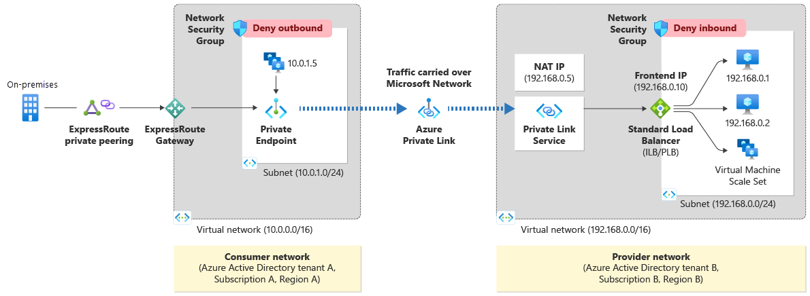
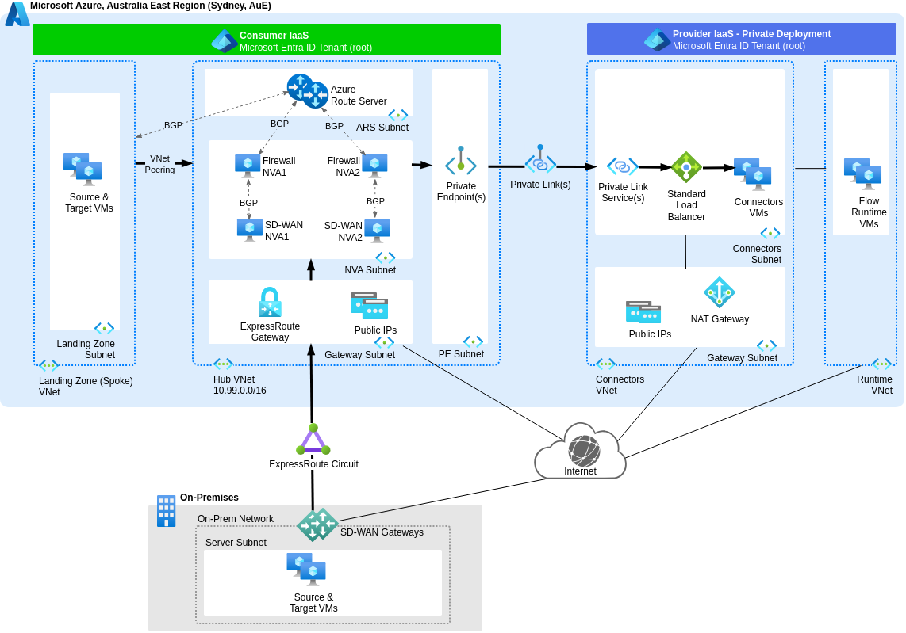

# Use Private Link Service(s) in Hub VNet for Private Deployment

## Context and Problem Statement

We aim to provide secure access between our 3rd-party managed Estuary Flow Private Deployment data plane in Azure Australia East and our various change data capture (CDC) targets and sources, both within the same Azure region and on-premises. To achieve this, we need to determine the most suitable private connectivity option.

Refer to [Reference Design](#reference-design) for a summary of the Azure Private Link components and Microsoft's reference architecture applicable to this use case. Additional considerations relating to the number of components are recorded in [ADR-0003](0003-use-dedicated-private-link-service-and-private-endpoint-pair-per-cdc-source-or-target.md)

## Decision Drivers

Align with the [Estuary Flow Private Deployment option](https://docs.estuary.dev/getting-started/deployment-options/#private-deployment) using Azure Private Link, and the design principles of the [Azure Well-Architected Framework (WAF)](https://learn.microsoft.com/en-us/azure/well-architected/pillars) pillars at the workload level:

* Operational Excellence
* Cost Optimisation
* Security
* Reliability
* Performance Efficiency

## Considered Options

* Azure Private Link Service(s) in Hub Virtual Network (VNet)
* Azure Private Endpoint(s) in Hub VNet
* Azure Private Link Services in (Target & Source Landing Zone) Spoke VNets
* Azure Private Endpoints in (Target & Source Landing Zone) Spoke VNets

## Decision Outcome

Chosen option: "Azure Private Link Service(s) in Hub VNet," because it provides centralised and scalable traffic management and aligns with Estuary's recommendation that we act as the service provider tenant to their private deployment tenant, which functions as the service consumer.

## Pros and Cons of the Options

### Azure Private Link Service(s) in Hub VNet

* Good reliability, because Estuary recommends that we act as the "service provider" tenant with a Private Link Service, while their "service consumer" tenant uses a Private Endpoint.
* Good reliability, because it aligns with Microsoft's [Azure Private Link](#reference-design) and [Private Link in a hub-and-spoke network](https://learn.microsoft.com/en-us/azure/architecture/networking/guide/private-link-hub-spoke-network) reference architectures. However, note that the "service provider" and "service consumer" roles are defined from the perspective of Estuary Flow CDC as the consumer. This differs from many ISV SaaS and PaaS models, where the commercial subscription host is typically the service provider.
* Good security and visibility, because policies can be managed centrally when traffic flows through the firewall Network Virtual Appliances (NVA) in the Azure Hub VNet. Refer to traffic flow arrows in [the chosen conceptual design below](#chosen-option-azure-private-link-services-in-hub-vnet).
* Good operationally, because a Private Link Service accessible to all peered Spoke VNets scales well.
* Neutral operationally, because it enables **customised** and safe deployment practices with automation using [Azure Verified Modules for Platform Landing Zones (ALZ)](https://azure.github.io/Azure-Landing-Zones/terraform/). A Private Link Service only exists in the [AVM **proposed** module catalog (number 41)](https://azure.github.io/Azure-Verified-Modules/indexes/terraform/tf-resource-modules/#proposed-modules---), therefore further customisation is required.

### Azure Private Endpoint(s) in Hub VNet

* Bad reliability, because Estuary does not recommend that our "service consumer" tenant uses a Private Endpoint while they act as the "service provider" tenant with a Private Link Service.
* Good reliability, because it aligns with Microsoft's [Azure Private Link](#reference-design) and [Private Link in a hub-and-spoke network](https://learn.microsoft.com/en-us/azure/architecture/networking/guide/private-link-hub-spoke-network) reference architectures.
* Good security and visibility, because policies can be managed centrally when traffic flows through the firewall Network Virtual Appliances (NVA) in the Azure Hub VNet. Refer to traffic flow arrows in [the considered conceptual design below](#not-selected-azure-private-endpoints-in-hub-vnet).
* Good operationally, because a Private Endpoint accessible to all peered Spoke VNets scales well.
* Good operationally, because it enables **standardised** and safe deployment practices with automation using [Azure Verified Modules for Platform Landing Zones (ALZ)](https://azure.github.io/Azure-Landing-Zones/terraform/). A [Private Endpoint module](https://registry.terraform.io/modules/Azure/avm-res-network-privateendpoint/azurerm/latest) exists in the [AVM **published** module catalog (number 63)](https://azure.github.io/Azure-Verified-Modules/indexes/terraform/tf-resource-modules/#published-modules-----).

### Azure Private Link Services in Spoke VNets

* Good reliability, because Estuary recommends that we act as the "service provider" tenant with a Private Link Service, while their "service consumer" tenant uses a Private Endpoint.
* Bad security and visibility, because centralised policy management is difficult when traffic does not flow through the firewall Network Virtual Appliances (NVA) in the Azure Hub VNet.

### Azure Private Endpoints in Spoke VNets

* Bad reliability, because Estuary does not recommend that our "service consumer" tenant uses a Private Endpoint while they act as the "service provider" tenant with a Private Link Service.
* Bad security and visibility, because centralised policy management is difficult when traffic does not flow through the firewall Network Virtual Appliances (NVA) in the Azure Hub VNet.

## More Information

[ADR-0001](0001-use-estuary-flow-private-deployment.md) reasons about selecting the Estuary Flow Private Deployment.

### Reference Design

[Azure Private Link](https://learn.microsoft.com/en-us/azure/private-link/private-link-overview) enables private access to Azure PaaS services or private connectivity between resources across different Microsoft Entra ID tenants. Traffic is routed over the Microsoft backbone network instead of the public internet, enhancing security and reducing exposure.

The two use cases for enabling private connectivity each leverage specific Azure components:

1. Access from Azure IaaS resources to Azure PaaS services:
    * [Private Endpoint](https://learn.microsoft.com/en-us/azure/private-link/private-endpoint-overview), a network interface in the consumer’s tenant and virtual network, mapped to a PaaS service.

2. Connectivity between Azure IaaS resources across different Microsoft Entra ID tenants:
    * [Private Link Service](https://learn.microsoft.com/en-us/azure/private-link/private-link-service-overview), in the service provider’s tenant and virtual network, providing access to services behind a Standard Load Balancer.
    * [Private Endpoint](https://learn.microsoft.com/en-us/azure/private-link/private-endpoint-overview), a network interface in the service consumer’s tenant and virtual network, mapped to the Private Link Service.

Microsoft's reference architecture for the second use case, which is the design considered in this decision record, is illustrated in the following diagram:

### Conceptual Design

#### Chosen Option: Azure Private Link Service(s) in Hub VNet

The following diagram shows the proposed deployment of one or more Private Link Services in a Hub VNet that satisfies this decision record. Refer to the arrows for data plane traffic from Estuary Flow Private Deployment Connectors to sources and targets.

Edit a copy of the above diagram in Draw.io [from the main branch](https://app.diagrams.net/#Uhttps://raw.githubusercontent.com/NetAion/avm-compositions/main/docs/diagrams/source/private-link.drawio) or [from the develop branch](https://app.diagrams.net/#Uhttps://raw.githubusercontent.com/NetAion/avm-compositions/develop/docs/diagrams/source/private-link.drawio).

#### Not Selected: Azure Private Endpoint(s) in Hub VNet

For comparison, the following diagram shows one or more Private Endpoints in a Hub VNet that was a considered option for this decision record and was not selected. Refer to the arrows for data plane traffic from sources to Estuary Flow Private Deployment Connectors.

Edit a copy of the above diagram in Draw.io [from the main branch](https://app.diagrams.net/#Uhttps://raw.githubusercontent.com/NetAion/avm-compositions/main/docs/diagrams/source/private-link.drawio) or [from the develop branch](https://app.diagrams.net/#Uhttps://raw.githubusercontent.com/NetAion/avm-compositions/develop/docs/diagrams/source/private-link.drawio).
